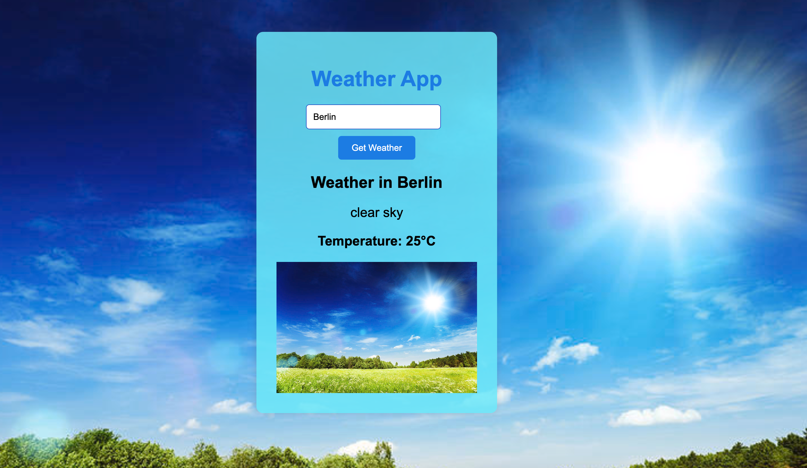

# Weather App

## Description:
This is a simple weather app that allows users to fetch and display weather information for a given city using the OpenWeatherMap API. The app fetches weather data based on the user's input and displays relevant information along with an appropriate weather icon.


## Table of Contents

- [Installation](#installation)
- [Usage](#usage)
- [API Key](#api-key)
- [Weather Icons](#weather-icons)
- [Contributing](#contributing)

## Installation

1. Clone this repository to your local machine using:
   ```sh
   git clone <repository_url>
   ```

2. Navigate to the project directory:
   ```sh
   cd weather-app
   ```

## Usage

1. Open the `index.html` file in a web browser.

2. Enter the desired location (city, state, and country) in the input field.

3. Click the "Fetch Weather" button to retrieve weather information for the provided location.

## API Key

The app uses the OpenWeatherMap API to fetch weather data. To use the API, you need to provide your API key. Follow these steps:

1. Sign up on the [OpenWeatherMap website](https://home.openweathermap.org/users/sign_up) to get an API key.

2. Create a file named `secrets.js` in the same directory as `weatherFunction.js`.

3. Inside `secrets.js`, declare and export your API key as follows:
   ```javascript
   export const apiKey = 'YOUR_API_KEY_HERE';
   ```

## Weather Icons

Weather icons are displayed based on the weather condition. The `weatherImages.js` file contains a function `getWeatherImageSrc` that maps weather condition codes to image URLs. Images are sourced from Unsplash.

## Contributing

Contributions are welcome! If you find any issues or want to add new features, feel free to open a pull request.

1. Fork the repository.

2. Create a new branch for your feature/fix:
   ```sh
   git checkout -b feature/new-feature
   ```

3. Make your changes and commit them:
   ```sh
   git commit -m "Add new feature"
   ```

4. Push the changes to your fork:
   ```sh
   git push origin feature/new-feature
   ```

5. Open a pull request on the original repository.


---

Enjoy using the Weather App! If you have any questions or need further assistance, feel free to reach out.
